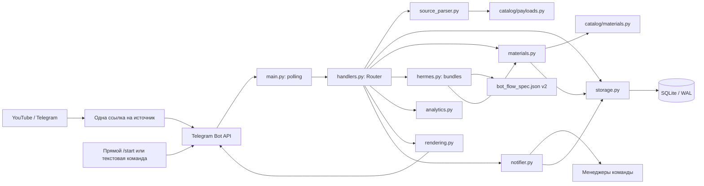
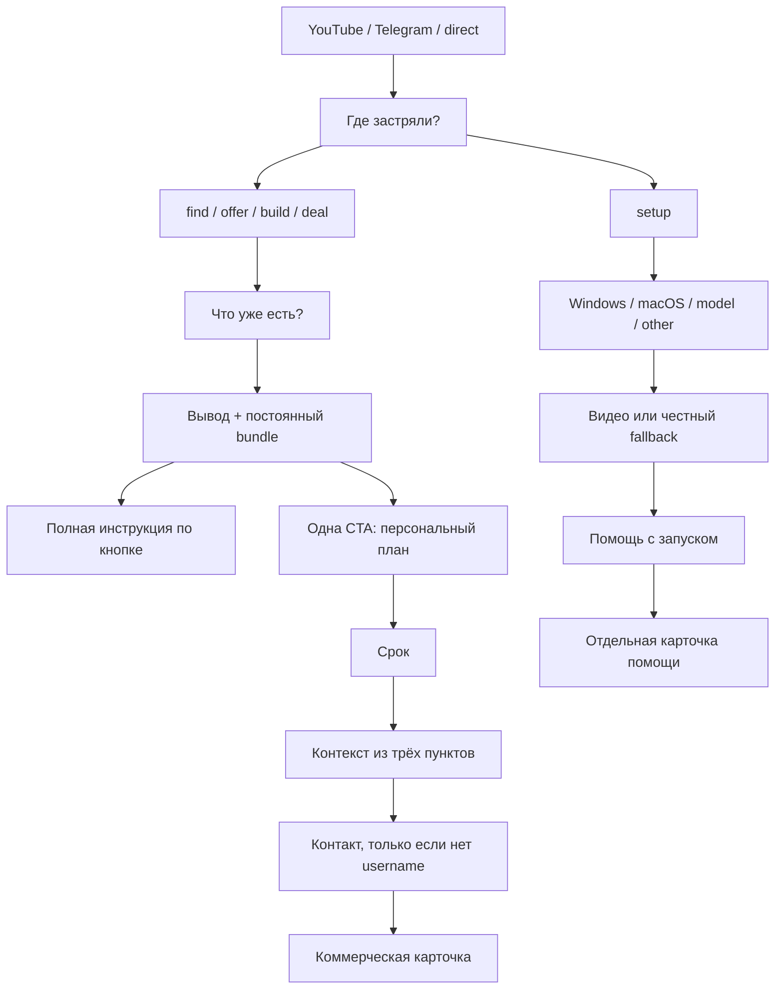
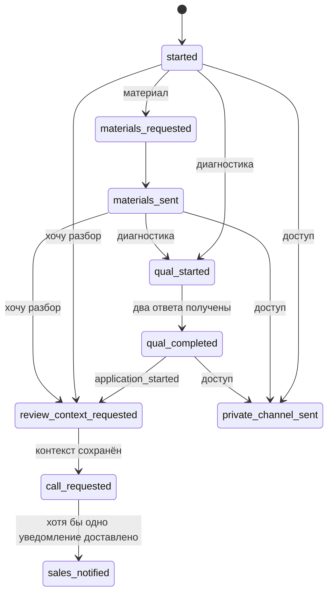
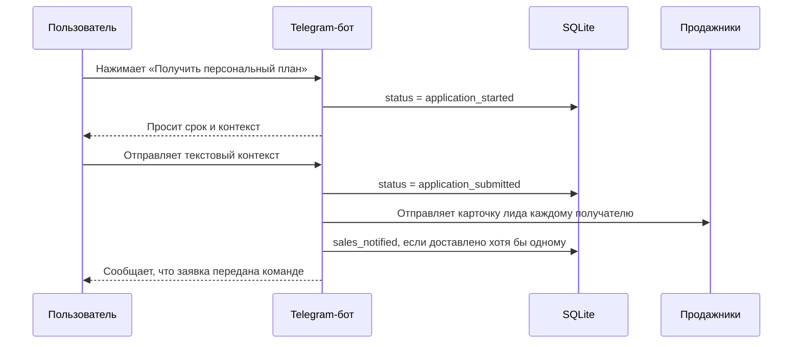

# Архитектура VC Funnel Bot

Актуально на 24 июля 2026 года. Документ описывает существующую реализацию из каталога `vc_funnel_bot`, а не целевую архитектуру на будущее.

## 1. Назначение и границы

`VC Funnel Bot` — отдельный Telegram-бот для маршрута Hermes:

```text
YouTube / Telegram / direct -> два вопроса -> материалы
-> персональный план -> контекст -> менеджер команды
```

Бот решает четыре задачи:

1. Сохраняет источник как YouTube, Telegram или direct.
2. После двух ответов выдаёт релевантный bundle и полную инструкцию по кнопке.
3. Хранит карточку лида и журнал событий.
4. Передаёт заявку продажникам только после явного запроса и текстового контекста от пользователя.

Это самостоятельное приложение. Оно не использует старый `telegram_bot`, API лендинга, SWOP/RKO API, старую SQLite-базу или Google Sheets.

В текущей версии нет LLM, распознавания голоса, фоновых follow-up, CRM и календаря.

## 2. Общая схема



Основной принцип: один вход или callback приводит к одному следующему экрану. Бот не запускает следующий этап воронки без действия пользователя.

## 3. Технологии и процесс запуска

- Python 3.12.
- `aiogram 3` — Telegram Bot API и long polling.
- `aiosqlite` — асинхронная работа с SQLite.
- `python-dotenv` — загрузка настроек из `.env`.
- Один процесс приложения и одна SQLite-база.
- Webhook не используется.

Точка входа — `bot/main.py`:

1. Загружает настройки.
2. Открывает SQLite и создаёт/обновляет схему.
3. При необходимости регистрирует публичные команды Telegram.
4. Создаёт `Dispatcher`, подключает один роутер `vc_funnel`.
5. Запускает long polling.
6. При остановке закрывает HTTP-сессию Telegram и соединение с БД.

## 4. Структура каталогов

```text
vc_funnel_bot/
├── .env.example              # пример конфигурации без секретов
├── README.md                 # запуск и операционные инструкции
├── ARCHITECTURE.md           # этот документ
├── requirements.txt          # Python-зависимости
├── bot/
│   ├── main.py               # запуск приложения и polling
│   ├── config.py             # Settings, env и путь к SQLite
│   ├── handlers.py           # команды, callbacks, маршрутизация и сценарии
│   ├── source_parser.py      # разбор payload и текстовых триггеров
│   ├── models.py             # типы SourceInfo, Lead, Event, Material
│   ├── storage.py            # схема SQLite, лиды, события и материалы
│   ├── analytics.py          # сегменты, боли, результат и температура
│   ├── materials.py          # выбор материала по payload и fallback
│   ├── notifier.py           # формирование и отправка заявки продажникам
│   ├── rendering.py          # edit-or-send, typing и очистка экранов
│   ├── messages.py           # пользовательские тексты
│   ├── keyboards.py          # inline-кнопки и callback-коды
│   └── catalog/
│       ├── payloads.py       # известные deep links и их entry mode
│       └── materials.py      # встроенные описания материалов
├── data/
│   └── vc_funnel.db          # runtime-база, не хранится в Git
└── tests/
    ├── test_source_parser.py
    ├── test_flow_rules.py
    ├── test_routing.py
    ├── test_storage.py
    └── test_materials_admin.py
```

## 5. Как обрабатывается вход

### 5.1 Deep link

Формат ссылки:

```text
https://t.me/viberko_bot?start=<payload>
```

Боевые ссылки Андрея:

```text
https://t.me/viberko_bot?start=am_p01_video
https://t.me/viberko_bot?start=am_p02_map
https://t.me/viberko_bot?start=am_p03_demo
https://t.me/viberko_bot?start=am_p04_route
https://t.me/viberko_bot?start=am_p05_apply
```

У каждой ссылки есть точная запись в каталоге:

```text
source       = andrey_main
post_id      = p01 ... p05
post_topic   = тема конкретного поста
campaign     = andrey_main_p01 ... andrey_main_p05
CTA          = video / map / demo / route / apply
material_key = равен payload
```

Для неизвестных payload работает эвристический parser. Он принимает разделители `_`, `-`, `:` и пробел. Если источник определить нельзя, бот сохраняет payload как неизвестный и показывает универсальное меню.

### 5.2 Каталог известных payload

Известные payload сначала ищутся в `catalog/payloads.py`. Каталог задаёт точные `group`, `entry_mode`, материал, post ID, тему и CTA. Эвристический parser используется как fallback для новых ссылок.

| Группа | Примеры | Первый сценарий |
|---|---|---|
| Основной канал Андрея | `am_p01_video`, `am_p02_map`, `am_p03_demo` | конкретный материал |
| Основной канал Андрея | `am_p04_route` | персональный маршрут из двух вопросов |
| Основной канал Андрея | `am_p05_apply` | запрос текстового контекста |
| YouTube | `yt_video_0704_description`, `..._pinned`, `..._comment`, `..._qr` | материал |
| Telegram | `tg_tgk_post_0704_materials` | материал |
| Telegram | `tg_tgk_post_0705_diagnostic`, `tg_ztgk_post_0705_closer` | диагностика |
| Telegram | `tg_post_0808_access`, `access_0808`, `dostup_0808` | доступ в канал |
| Приватный канал | `ch_0706_agent_lost_leads_materials` | контекстный материал |
| Приватный канал | `ch_0706_agent_lost_leads_diagnostic`, `ch_0708_rko_bridge_check` | контекстная диагностика |
| Приватный канал | `ch_0706_agent_lost_leads_call` | запрос контекста заявки |
| Приватный канал | `ch_0709_want_vc` | выбор формата VC, затем контекст |

### 5.3 Текстовые входы

При `VC_ENABLE_TEXT_TRIGGERS=true` поддерживаются фразы:

- `доступ` и `стать ближе` -> доступ в канал;
- `материалы` -> материал;
- `разбор` и `созвон` -> запрос контекста заявки;
- другой текст внутри незавершённого legacy-сценария -> старый безопасный экран.

До маршрутизации свободного текста бот проверяет его на признаки паспортных, банковских и платёжных данных. Подозрительный текст не сохраняется как контекст заявки.

## 6. Пользовательские сценарии

| `entry_mode` | Откуда приходит пользователь | Первый экран | Возможное продолжение |
|---|---|---|---|
| `hermes_bottleneck` | `youtube_hermes`, `telegram_hermes`, пустой `/start`, `/menu` | первый вопрос Hermes | второй вопрос, bundle и один целевой переход |
| `universal_start` | внутренний legacy fallback | старый безопасный экран | legacy-сценарии |
| `external_materials` | `am_p01`–`p03` и legacy | обещанный материал | канал или персональный маршрут |
| `direct_materials` | текст «материалы» | основное видео | канал или персональный маршрут |
| `external_diagnostic` | `am_p04_route` и legacy | вопрос 1 из 2 | вопрос 2, результат и запрос контекста |
| `access_gate` | access/dostup | доступ в канал | завершение текущего шага |
| `direct_review_request` | `am_p05_apply` или legacy-текст | просьба описать ситуацию | заявка после текста |
| `channel_materials` | legacy CTA из приватного канала | материал по теме поста | канал или персональный маршрут |
| `channel_diagnostic` | CTA diagnostic/check | один контекстный вопрос | результат, возврат в канал, разбор |
| `channel_call` | CTA call | просьба описать ситуацию | заявка продажникам |
| `channel_want_vc` | CTA want_vc | выбор формата участия | просьба описать ситуацию, заявка продажникам |

Правила переходов:

- материал не запускает диагностику автоматически;
- после двух ответов бот просит один текстовый контекст;
- доступ в канал не запускает разбор автоматически;
- сам клик по CTA не отправляет заявку;
- на продажи уходит только явная заявка после текстового контекста;
- полезный результат пользователь получает максимум после двух вопросов.

## 7. Диагностика и квалификация

Обычная диагностика состоит из двух вопросов.

Первый вопрос сохраняет `segment`:

- работаю с РКО / финансовыми офферами;
- есть трафик, база или Telegram-канал;
- есть продукт, команда или отдел продаж;
- только начинаю.

Второй вопрос сохраняет `pain`:

- получать больше заявок;
- собрать лендинг, бота или воронку;
- автоматизировать обработку людей;
- научиться собирать решения самостоятельно.

После второго ответа `analytics.py` формирует короткий персональный результат, а бот просит одним сообщением описать исходную ситуацию, проблему и желаемый результат. До этого сообщения notifier не вызывается. Контекстная legacy-диагностика из приватного канала остаётся сокращённой до одного вопроса.

### 7.1. Основной маршрут Hermes

Публичные входы: `youtube_hermes` и `telegram_hermes`. Обычный `/start`
открывает тот же маршрут с `source=direct`. `am_hermes_video_route` и
остальные старые payload продолжают работать, но скрыты из `/links`.

`bot/catalog/hermes.py` загружает
`material_packs/hermes_first_audit/bot_flow_spec.json` версии 2. Первый
ответ сохраняется в `pain`, второй — в `segment`. Поле `intent` остаётся
свободным до явного запроса персонального плана или помощи с запуском.

После второго ответа `bot/hermes.py` последовательно выдаёт bundle и
продолжает работу, если один из файлов отсутствует. Полная инструкция
`hermes_full_playbook` не входит в bundle и отправляется только по отдельной
кнопке.



Три setup-видео могут добавляться позднее без деплоя. При их отсутствии
setup-ветка остаётся доступной и показывает честный fallback.

## 8. Модель состояния лида

Один `telegram_id` соответствует одной активной карточке.



Поддерживаемые статусы:

```text
started
materials_requested
materials_sent
qual_started
qual_completed
route_completed
private_channel_sent
call_cta_shown
contact_requested
review_context_requested
application_started
application_context_requested
application_submitted
setup_context_requested
support_requested
call_requested
sales_notified
not_ready
```

Температура рассчитывается отдельно от статуса:

- `cold` — старт, только материал или режим наблюдения;
- `warm` — есть квалификация, материал или вход в канал без запроса разговора;
- `sql` — пользователь запросил разбор;
- `hot_sql` — запрос разбора сочетается с горячим источником/сегментом или интересом к участию в VC.

После `call_requested` или `sales_notified` источник блокируется: повторный `/start` обновляет только `latest_start_payload`, но не затирает исходную атрибуцию. Новые сообщения дописываются в `application_context` без повторного уведомления продажникам.

Для `intent=setup_help` контекст или скриншот передаётся тем же
получателям отдельной карточкой. Дедуп работает через
`support_notified`; событие `sales_notified` не используется.

## 9. Материалы

Материал может быть текстом, URL или Telegram-вложением: document, photo, video или animation.

После любого материала показываются ровно две кнопки:

- `📲 Смотреть следующие разборы в канале` — прямая URL-кнопка, если invite URL настроен;
- `🎯 Подобрать связку под мою ситуацию` — запускает двухвопросный маршрут.

Универсальное меню перед обещанным материалом не показывается.

Порядок разрешения материала:

1. Активная привязка `payload -> material_key` из SQLite.
2. Активный материал из SQLite.
3. Встроенный `MATERIAL_CATALOG` и URL из env.
4. Общий URL из env по источнику пользователя.
5. Экран «материал пока не загружен».

Контент-менеджер может управлять материалами без деплоя через `/admin_materials` и `/material_add`. Мастер последовательно спрашивает key, название, описание, URL, файл и payload для привязки. Состояние мастера хранится в памяти процесса и сбрасывается при рестарте бота; уже сохранённые материалы остаются в SQLite.

Hermes добавляет слой bundles без новых таблиц. Result и каждый выданный
bundle-файл отправляются как persistent: renderer не записывает их ID в
`bot_screen_message_ids`, поэтому cleanup временных экранов их не удаляет.

`bot/material_importer.py` валидирует CSV manifest, в dry-run показывает
готовые/отсутствующие файлы, а в apply-режиме загружает файл в служебный
admin chat, получает Telegram `file_id` и делает idempotent upsert через
`VcStorage`. Активный загруженный key пропускается без `--force`.

## 10. Передача заявки продажникам

Последовательность заявки:



Карточка для менеджера содержит только практические поля: источник, узкое
звено, текущую ситуацию, срок, выданные материалы, факт открытия полной
инструкции, контекст, имя, username, Telegram ID, контакт и время создания.
Внутренние payload, CJM и message IDs не выводятся. Помощь с запуском
получает отдельную карточку и не считается коммерческой заявкой.

В production заявки отправляются трём получателям:

```text
1238046892
7364640378
278533547
```

Те же три ID имеют права администратора.

Защита от дублей работает по общему флагу `sales_notified`. ID получателей дедуплицируются перед отправкой. Если часть отправок упала, а хотя бы одна прошла, заявка считается уведомлённой; автоматического повтора для недоставленных получателей сейчас нет.

Если список получателей пуст или Telegram отклонил все отправки, лид и контекст остаются в базе, а причина записывается в events. Бот продолжает работать.

## 11. Хранилище

SQLite работает в режиме WAL. Схема создаётся при старте; для добавленных полей есть простая миграция через `ALTER TABLE`.

### `vc_funnel_leads`

Одна строка на Telegram-пользователя. Группы полей:

- идентичность: `telegram_id`, `username`, `first_name`, `contact`;
- атрибуция: `raw_start_payload`, `latest_start_payload`, `source_type`, `source_channel`, `source`, `entry_surface`, `entry_mode`, `campaign`, `content_id`, `cta_type`, `cjm`, `post_id`, `post_slug`, `post_topic`;
- квалификация: `segment`, `pain`, `intent`, `application_context`;
- состояние: `lead_status`, `lead_temperature`, `materials_sent`, `private_channel_sent`, `call_requested`, `sales_notified`, `sales_notified_at`;
- UX: `last_bot_screen_message_id`, `bot_screen_message_ids`;
- время: `created_at`, `updated_at`, `last_interaction_at`.

### `vc_funnel_events`

Append-only журнал действий: `telegram_id`, `event_type`, JSON payload и время. Используется для диагностики, аналитики, истории лида и фиксации ошибок отправки.

### `vc_funnel_materials`

Материалы с уникальным `material_key`: название, текст, URL, Telegram file ID/type/name/caption, активность и даты.

### `vc_funnel_payload_materials`

Активная привязка одного payload к одному `material_key`, с необязательным `title_override`.

## 12. Рендеринг и конкурентность

`BotScreenRenderer` старается редактировать текущий экран вместо отправки цепочки новых сообщений. Если редактирование невозможно, отправляется новое сообщение.

Дополнительные правила:

- каждый callback подтверждается через `answerCallbackQuery`;
- старые inline-клавиатуры снимаются;
- бот может показать `typing` и выдержать настраиваемую паузу;
- при включённой очистке удаляются только старые сообщения бота;
- сообщения пользователя и текст заявки не удаляются;
- последние ID экранов хранятся в карточке лида;
- callbacks одного пользователя защищены in-memory lock от двойного нажатия;
- обновление карточки одного лида в storage также защищено отдельным in-memory lock.

Эти блокировки действуют только внутри одного процесса. Архитектура рассчитана на один polling-процесс с одним токеном.

## 13. Команды

Публичное меню BotFather содержит только:

```text
/start
/menu
/help
```

Обработчики обратной совместимости остаются доступными, но не показываются в публичном меню:

```text
/materials
/diagnostic
/access
/review
/reset_vc
```

`/reset_vc` удаляет только собственную тестовую карточку пользователя и позволяет пройти путь заново.

Админ-команды доступны только ID из `VC_ADMIN_IDS`:

```text
/admin
/links
/testlink <payload>
/preview <payload>
/admin_materials
/hermes_readiness
/material_add
/material_set_url <material_key> <url>
/material_bind <payload> <material_key>
/material_unbind <payload>
/material_delete <material_key>
/material_preview <material_key>
/leads
/lead <telegram_id>
/events [telegram_id]
/stats
/export_leads
/admin_reset <telegram_id>
```

`/preview` не создаёт лида, не меняет state и не отправляет уведомление продажникам.
Для Hermes preview-кнопки имеют admin callback и не запускают
пользовательский маршрут.

Manifest CLI:

```text
python -m bot.material_importer
python -m bot.material_importer --apply --upload-chat-id <chat_id>
```

## 14. Конфигурация

Все настройки имеют префикс `VC_` и загружаются из `vc_funnel_bot/.env`.

| Группа | Переменные |
|---|---|
| Telegram | `VC_BOT_TOKEN`, `VC_BOT_USERNAME`, `VC_SET_BOT_COMMANDS_ON_START` |
| Доступ | `VC_ADMIN_IDS`, `VC_SALES_CHAT_ID`, `VC_PRIVATE_CHANNEL_INVITE_URL` |
| База | `VC_DATABASE_URL`, `VC_SQLITE_PATH` |
| Материалы | `VC_MATERIALS_TITLE`, `VC_MATERIALS_URL`, `VC_YOUTUBE_MATERIALS_URL`, `VC_TELEGRAM_MATERIALS_URL` |
| UX | `VC_CLEANUP_OLD_BOT_MESSAGES`, `VC_KEEP_LAST_BOT_MESSAGES`, `VC_UX_TYPING_DELAY_ENABLED`, `VC_UX_TYPING_DELAY_SECONDS`, `VC_UX_TYPING_DELAY_TEST_MODE`, `VC_ENABLE_TYPEWRITER` |
| Функции | `VC_ENABLE_TEXT_TRIGGERS`, `VC_ENABLE_FOLLOWUPS`, `VC_DEBUG`, `VC_DEFAULT_TIMEZONE` |

`VC_BOT_TOKEN` обязателен. `VC_DATABASE_URL` в текущей версии принимает только `sqlite:///...`. Секреты не должны попадать в Git, документацию, сообщения или логи.

## 15. Админ-контур и наблюдаемость

Операционные данные доступны внутри Telegram:

- `/leads` — последние 20 пользователей;
- `/lead` — полная карточка одного лида;
- `/events` — последние события;
- `/stats` — общие числа, статусы и payload;
- `/export_leads` — CSV;
- `/preview` — безопасная проверка первого экрана deep link;
- `/links` — каталог ссылок и статус материалов.
- `/hermes_readiness` — статусы 11 Hermes material keys и готовность каждого bundle;

Чувствительный текст маскируется в админ-карточках, events и CSV. Технические логи пишутся в stdout и в production читаются через systemd journal.

Основные события воронки Андрея:

| Event | Когда создаётся |
|---|---|
| `post_entry_started` | каждый вход по известному payload `am_*` |
| `material_delivered` | материал реально отправлен как текст, URL или Telegram-файл |
| `channel_cta_clicked` | callback перехода к экрану канала; `membership_verified=false` |
| `route_started` | показан первый вопрос |
| `route_completed` | сохранён второй ответ |
| `application_started` | бот запросил текстовый контекст |
| `application_context_submitted` | безопасный контекст сохранён |
| `sales_notified` | уведомление доставлено хотя бы одному sales-получателю |

События основного маршрута:

| Event | Когда создаётся |
|---|---|
| `route_started` | показан первый вопрос |
| `bottleneck_selected` | сохранено узкое звено |
| `situation_selected` | сохранена текущая ситуация |
| `bundle_delivered` | завершена выдача bundle |
| `full_playbook_requested` | пользователь запросил полную инструкцию |
| `application_started` | нажата CTA персонального плана |
| `urgency_selected` | выбран желаемый срок |
| `application_submitted` | сохранён контекст и готова заявка |
| `sales_notified` | коммерческая карточка доставлена |
| `support_requested` | сохранён запрос помощи |
| `support_notified` | карточка помощи доставлена |
| `channel_clicked` | пользователь запросил ссылку канала |

После материала invite URL открывается прямой URL-кнопкой ради перехода в одно нажатие. Telegram не сообщает боту о клике по такой кнопке и фактическом вступлении, поэтому бот не пишет событие `channel_joined` и не считает пользователя вступившим.

## 16. Текущий production-деплой

```text
Bot:       @viberko_bot (VibeRKO)
Server:    81.19.136.203
Path:      /opt/landing_rko/current/vc_funnel_bot
Service:   vc-funnel-bot.service
Mode:      systemd + long polling
Database:  /opt/landing_rko/current/vc_funnel_bot/data/vc_funnel.db
Env:       /opt/landing_rko/current/vc_funnel_bot/.env
```

Старый `rko-bot.service` отключён, потому что два polling-процесса не могут одновременно использовать один Telegram-токен. `rko-admin.service` работает отдельно и в эту архитектуру не входит.

Новая итерация развернута в production 19 июля 2026 года. Сервис работает с пятью payload `am_*`, публичными командами `/start`, `/menu`, `/help` и тремя sales/admin-получателями.

Перед публикацией первых трёх постов нужно загрузить содержимое материалов `am_p01_video`, `am_p02_map` и `am_p03_demo`. Invite URL канала уже настроен.

Текущая Hermes-итерация использует две публичные ссылки, один основной
двухвопросный маршрут, отдельные sales/support-карточки и полную инструкцию
`hermes_full_playbook`. После её загрузки ожидаемая readiness — `9/12`;
три setup-видео остаются отдельным контентным обязательством и до загрузки
используют честный fallback.

Операционные команды на сервере:

```bash
systemctl status vc-funnel-bot.service
journalctl -u vc-funnel-bot.service -f
systemctl restart vc-funnel-bot.service
```

## 17. Проверки

Тесты покрывают:

- точную атрибуцию пяти payload основного канала Андрея;
- прямую выдачу трёх обещанных материалов;
- двухвопросный маршрут и apply-сценарий;
- события от `post_entry_started` до `sales_notified`;
- parser известных и новых payload;
- правила переходов между материалом, диагностикой, каналом и заявкой;
- отсутствие автоматической отправки продажникам;
- дедупликацию и отправку заявки нескольким получателям;
- безопасное поведение при ошибке Telegram;
- хранение и сброс лида;
- материалы, привязки и env fallback;
- admin preview без создания лида.
- Hermes payload, обе разновидности второго вопроса и пять result tracks;
- порядок, частичную готовность и persistent-доставку bundles;
- channel/apply semantics, setup-media и notification dedup;
- readiness, Hermes stats и idempotent manifest importer.

Команды проверки:

```bash
cd vc_funnel_bot
python -m compileall bot
python -m unittest discover -s tests -v
```

Для общей проверки репозитория:

```bash
pnpm lint
pnpm build
```

## 18. Ограничения текущей версии

- Один процесс, один polling worker, одна локальная SQLite-база.
- In-memory locks и мастер добавления материала не переносятся между процессами.
- Нет автоматического retry для недоставленного sales notification.
- Нет webhook, очереди задач, отдельного scheduler и горизонтального масштабирования.
- Follow-up флаг существует, но сам follow-up scheduler не реализован.
- Нет синхронизации с Google Sheets или CRM.
- Нет календарного бронирования.
- Нет LLM, voice и STT.
- Аналитика доступна через SQLite, events, Telegram admin и CSV; отдельного dashboard нет.

## 19. Где расширять систему

- Новый точный deep link: `bot/catalog/payloads.py` и тест parser/routing.
- Новая тема поста без отдельной логики: `POST_TOPICS` в `bot/source_parser.py`.
- Новый встроенный материал: `bot/catalog/materials.py`.
- Новый материал без деплоя: `/material_add` и `/material_bind`.
- Новый пользовательский сценарий: `entry_mode` в models/parser и ветка `route_entry` в `handlers.py`.
- Новая кнопка: `bot/keyboards.py`, затем обработка callback в `handlers.py`.
- Новый статус или поле: `bot/models.py`, `bot/storage.py` и миграция в `_ensure_columns`.
- Изменение sales-карточки: `bot/notifier.py`.
- Изменение текстов: `bot/messages.py`.

При расширении важно сохранить три инварианта: сначала польза, максимум два вопроса до результата, продажи только после явного контекста пользователя.
